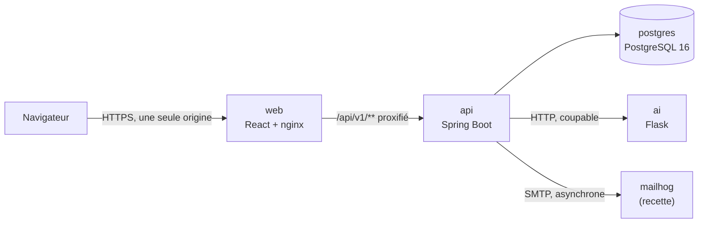
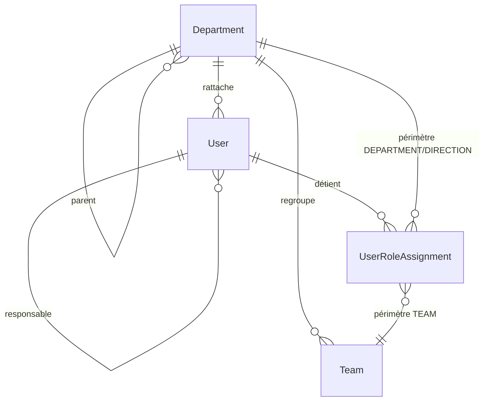
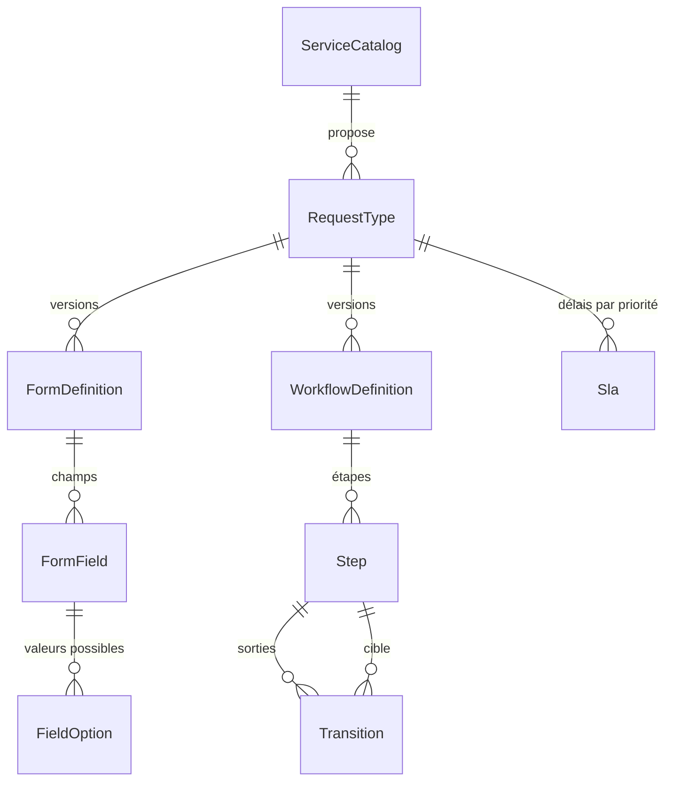
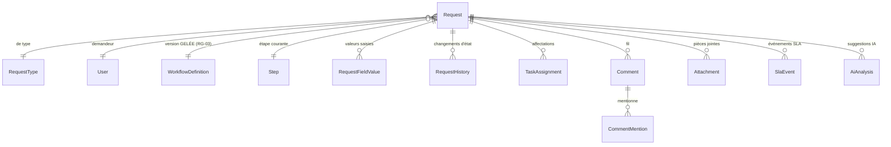
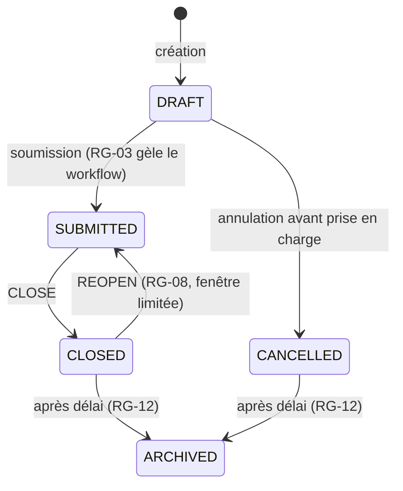
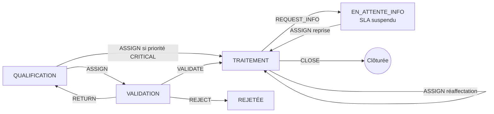
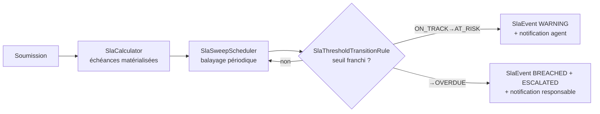

# Dossier de conception — SmartFlow IT

**Ancrage : §17.1** (« Dossier de conception : architecture, diagrammes UML, modèle de
données et règles de sécurité »), §9 (conception générale), §10 (modèle de données),
§11 (interfaces et API), §13 (sécurité et traçabilité).

Ce document décrit le système **tel qu'il est construit**, pas tel qu'il avait été imaginé :
chaque section renvoie au code qui la réalise. Les décisions que le cahier des charges
laissait ouvertes sont tranchées dans [`DECISIONS.md`](DECISIONS.md) (ADR-01 à ADR-24) et
ne sont pas re-argumentées ici — seulement citées.

---

## Sommaire

1. [Vue d'ensemble](#1-vue-densemble)
2. [Architecture applicative](#2-architecture-applicative)
3. [Modèle de données](#3-modèle-de-données)
4. [Cycle de vie d'une demande](#4-cycle-de-vie-dune-demande)
5. [Règles de sécurité](#5-règles-de-sécurité)
6. [Configurabilité et versionnement](#6-configurabilité-et-versionnement)
7. [SLA](#7-sla)
8. [Module d'intelligence artificielle](#8-module-dintelligence-artificielle)
9. [Traçabilité](#9-traçabilité)
10. [Conventions d'API](#10-conventions-dapi)

---

## 1. Vue d'ensemble



**Le navigateur ne voit qu'une seule origine.** `web` sert le SPA *et* proxifie `/api/v1/**`
vers `api` : le cookie de session et le jeton CSRF n'ont donc jamais à franchir une frontière
d'origine (ADR-01). C'est aussi pourquoi tout test réaliste passe par `localhost:5173`,
jamais par `localhost:8080`.

**Le service IA est coupable.** `AiClient` vérifie `smartflow.ai.enabled` **avant** toute
tentative réseau : une pile sans service IA reste pleinement fonctionnelle (§12.2, risque
« dépendance à un service externe » du §18).

---

## 2. Architecture applicative

### 2.1 Les cinq couches du §9.3

```
com.smartflow.backend
├── api               contrôleurs REST, DTO d'entrée/sortie, mappers
├── application       cas d'usage (@Transactional) et décisions d'autorisation
├── domain            entités, énumérations, règles pures, exceptions métier
├── infrastructure    repositories, stockage, e-mail, ordonnanceurs, client IA
└── crosscutting      configuration, sécurité, audit, format d'erreur, traceId
```

**Règle de dépendance** : `api → application → domain`. `infrastructure` implémente ce dont
`application` a besoin. **`domain` ne dépend de personne.**

Les cinq noms de premier niveau ne sont pas un choix de style : ils sont imposés par le §9.3
et assurent la traçabilité entre le code et le cahier des charges. Tout ce qui est à
l'intérieur suit le nommage Spring conventionnel, sur lequel le cahier des charges est muet.

### 2.2 Pourquoi `domain/rule` est pur

Aucune classe de `domain/rule` n'importe `org.springframework` ni n'accède à la base. Le
calcul d'une échéance SLA, la légalité d'une transition, la couverture d'un périmètre et
l'extraction d'une mention sont des fonctions : entrées → sortie. Elles se testent par un
test unitaire sans contexte Spring, en quelques millisecondes, ce qui est la condition de
l'indicateur du §3.4 (« tests unitaires sur règles métier et sécurité »).

Ces règles sont injectées comme *beans* par `crosscutting/config/DomainRuleConfig`, pour que
la couche application les reçoive normalement sans qu'aucune annotation Spring n'ait à
descendre dans `domain`.

| Règle pure | Ce qu'elle décide |
|---|---|
| `RolePermissionRule` | Quel rôle peut jamais exécuter quelle action |
| `ScopeRule` | Si un périmètre (`OWN`…`GLOBAL`) couvre une demande |
| `SeparationOfDutiesRule` | Si un demandeur valide son propre dossier |
| `WorkflowActionAvailabilityRule` | Quelles actions une étape propose |
| `TransitionResolutionRule` | Quelle transition une action emprunte, conditions comprises |
| `CommentRequirementRule` | Quand un commentaire est obligatoire (RG-05) |
| `FormValidationRule` | Validation serveur d'un formulaire configuré |
| `SlaCalculator`, `SlaSuspensionRule`, `SlaThresholdTransitionRule` | Échéances, suspension, franchissement de seuil |
| `AttachmentValidationRule` | Extension, taille, type MIME réel (RG-09) |
| `AutoAssignmentRule` | Le membre d'équipe le moins chargé |
| `MandatoryNotificationRule` | Les alertes non désactivables (ADR-12) |
| `MentionParsingRule` | Les adresses qu'un commentaire nomme (ADR-24) |

### 2.3 Front-end

React 19 + TypeScript, React Router, sans bibliothèque d'état globale : l'état vit dans les
écrans, et `AuthContext` porte seulement la session. `api/client.ts` centralise le CSRF, le
format d'erreur du §11.1 et la détection d'expiration de session (ADR-22).

**Un bouton d'action ne se déduit jamais d'un rôle côté React.** Il vient de
`availableActions[]`, que le serveur calcule. Le §11.1 est explicite : « le masquage dans
l'interface ne suffit pas » — et un écran qui déciderait lui-même finirait par diverger de la
décision serveur, ce qui est la définition d'une faille d'autorisation.

---

## 3. Modèle de données

Schéma géré **exclusivement par Flyway** (`backend/src/main/resources/db/migration`), avec
`ddl-auto=validate`. Une migration publiée ne se modifie jamais.

### 3.1 Organisation et identité



Une **direction** est un `Department` sans parent ; un **service** est un `Department`
enfant. Un compte n'est jamais « rattaché à une équipe » par une table d'appartenance :
c'est son `UserRoleAssignment` de portée `TEAM` qui l'y rattache — un rôle *dans* un
périmètre, jamais un rôle nu.

### 3.2 Catalogue, formulaire, workflow



`FormDefinition` et `WorkflowDefinition` sont **versionnées** (`DRAFT` / `PUBLISHED` /
`ARCHIVED`, ADR-17) ; le catalogue et les types de demande ne le sont pas.

### 3.3 La demande



Points de conception qui portent une règle de gestion :

- **`Request.reference`** vient d'une séquence PostgreSQL avec contrainte `UNIQUE`
  (RG-01, ADR-02) — jamais d'un `count(*) + 1`, qui réutiliserait un numéro dès la première
  suppression et se tromperait sous concurrence.
- **`Request.workflowDefinitionId` est gelé à la soumission** (RG-03). Le moteur résout
  toujours le graphe de *cette* version, jamais « la version actuellement publiée » :
  publier une v2 n'écrit aucune ligne de la v1, et une demande en cours ne bouge pas.
- **`RequestHistory`** porte une ligne par changement d'état, y compris la soumission
  elle-même (ADR-23). C'est la table qui répond à l'indicateur « 100 % des changements
  d'état » du §3.4.
- **Aucune suppression physique** d'une demande soumise (RG-02) ni d'un référentiel utilisé
  (RG-12) : un drapeau `active`, un statut `ARCHIVED`, jamais un `DELETE`.
- **`AiAnalysis` est une table à part** : l'IA n'écrit jamais sur `Request` (RG-10).

### 3.4 Entités de support

`Notification` / `NotificationPreference` / `EmailTemplate` (§6.8), `AuditLog` (RG-11),
`SystemParameter` (§6.10), `SlaEvent` (§6.7), `KnowledgeDocument` (§12.1 P2 — déclarée, non
consommée : les fonctions P2 sont hors périmètre).

---

## 4. Cycle de vie d'une demande

### 4.1 Statut (`RequestStatus`)



**Le statut ne suit pas chaque étape** (ADR-03). Une demande validée, affectée, en cours de
traitement ou en attente d'information reste `SUBMITTED` : l'avancement est porté par
`currentStep`, pas par le statut. Seule `CLOSE` clôture. C'est ce qui permet d'ajouter une
étape à un workflow sans toucher à l'énumération des statuts.

### 4.2 Étapes et actions

Les étapes ne sont pas dans le code : elles sont configurées. Les deux processus pilotes
livrés (§2.1) sont *Support Informatique* et *Achats*.



*(circuit Support Informatique, tel que `V5`, `V9` et `V10` le configurent)*

Deux actions ne sont **jamais** des arcs de ce graphe : `SUBMIT` (ADR-23) et `REOPEN`
(ADR-14). Elles écrivent une ligne d'historique mais sont exécutées directement par
`RequestService`, et `WorkflowAction.isConfigurable()` empêche un administrateur de les
câbler comme transitions.

---

## 5. Règles de sécurité

### 5.1 Une seule fonction de décision

Tout cas d'usage qui agit sur une demande passe par `AuthorizationService.canAct` :

```
canAct(utilisateur, demande, action) =
        roleAccordePermission(...)          RolePermissionRule       — §5
    ET  perimetreCouvre(...)                ScopeRule                — OWN|TEAM|DEPARTMENT|DIRECTION|GLOBAL
    ET  etapeAutoriseAction(...)            WorkflowActionAvailabilityRule
    ET  NON (separationDesTaches ...)       SeparationOfDutiesRule   — §5.1
```

**Ces règles ne sont jamais dispersées en `@PreAuthorize` dupliqués.** Une règle écrite à
deux endroits finit par diverger, et la divergence est une faille. Les décisions voisines
(`canView`, `canAnnotate`, `canReopen`, `canQualify`, `canViewDashboard`, `canViewAuditLog`,
`isFunctionalAdmin`, `isTechnicalAdmin`) vivent dans le même service et réutilisent les
mêmes règles pures — jamais une deuxième définition de « habilité sur cette demande ».

### 5.2 `404`, jamais `403`

Une ressource hors périmètre répond **404**. Un `403` confirmerait l'existence du dossier et
permettrait d'énumérer ceux des autres services. La même logique gouverne les mentions
(ADR-24 : une mention hors périmètre est ignorée en silence, sans message d'erreur qui
révélerait qui a accès à quoi).

### 5.3 Authentification et session

Session serveur portée par un cookie `HttpOnly`, `SameSite=Lax`, `Secure` par défaut
(ADR-01). Protection CSRF par jeton lisible en JavaScript et renvoyé en en-tête.

L'inactivité se mesure sur les **gestes de l'utilisateur**, pas sur le trafic HTTP
(ADR-22) : les appels périodiques du SPA portent un en-tête `X-SmartFlow-Background` et ne
repoussent pas l'échéance. Sans cela, un onglet laissé ouvert aurait maintenu une session
vivante indéfiniment — exactement ce que le §13 cherche à borner.

Les tentatives de connexion sont limitées (ADR-13) : verrouillage temporaire après N échecs,
avec un message **volontairement identique** à celui d'un mot de passe erroné — un compte
verrouillé ne doit pas être distinguable.

### 5.4 Fichiers (RG-09)

`AttachmentValidationRule` contrôle l'extension, la taille **et le type MIME déduit de la
signature du fichier**, pas de l'en-tête déclaré par le client. Les fichiers sont stockés
hors répertoire public sous un nom généré non devinable, et ne sont jamais servis comme
ressources statiques : chaque téléchargement passe par un contrôleur qui vérifie `canView`.

### 5.5 En-têtes et transport

`frontend/nginx.conf` pose CSP, `X-Content-Type-Options`, `X-Frame-Options: DENY`,
`Referrer-Policy` et `Permissions-Policy`, plus `client_max_body_size` aligné sur la limite
applicative.

---

## 6. Configurabilité et versionnement

Le §2.1 exige « l'ajout de nouveaux services sans modifier le code métier principal ». Deux
conséquences structurelles :

1. **Aucun `if (type == ACHAT)` dans le moteur.** Une différence entre deux processus est une
   différence de configuration — une étape, une transition, une condition — jamais une
   branche de code.
2. **Les formulaires et les workflows sont versionnés** (ADR-17). Publier une nouvelle
   version archive l'ancienne sans jamais la supprimer, et les demandes en cours continuent
   sur la version qu'elles ont gelée (RG-03). C'est vérifié par un test d'intégration dédié
   (`publishingNewVersionNeverAffectsInProgressRequest`, §14.1 scénario 8).

L'éditeur d'administration est **structuré** (tableaux d'étapes et de transitions), jamais un
canevas graphique : le §4.2 exclut explicitement un « moteur BPMN complet ».

---

## 7. SLA

**Modèle événementiel, jamais un compteur mutable** (RG-07). Les échéances sont calculées
à la soumission à partir du `Sla` configuré pour (type de demande, priorité), matérialisées
sur `Request`, et les franchissements de seuil produisent des `SlaEvent`.



Deux propriétés que la conception garantit :

- **Un statut SLA n'est jamais calculé à la volée dans une requête de tableau de bord.** Il
  est lu tel qu'il a été matérialisé — sinon chaque écran recalculerait, et deux écrans
  pourraient afficher deux vérités.
- **Une alerte n'est émise qu'une fois par franchissement**, pas à chaque balayage : c'est la
  règle pure qui compare l'état précédent au nouveau, pas l'ordonnanceur.

La **suspension** (§6.7) est portée par un drapeau `suspend_sla` sur l'étape : entrer dans
`EN_ATTENTE_INFO` suspend le compteur, en sortir le reprend (ADR-20). Le calendrier ouvré
reste une extension explicitement hors socle (ADR-09).

---

## 8. Module d'intelligence artificielle

Deux fonctions P1 du §12.1 : **classification** (catégorie + priorité) et **résumé**. Les
fonctions P2/Option sont hors périmètre.

**Deux approches comparées**, comme le §12.2 l'exige : un classifieur à base de règles et un
classifieur ML (TF-IDF + régression logistique). Le protocole d'évaluation et les résultats
sont dans [`../ai-service/EVALUATION.md`](../ai-service/EVALUATION.md).

Le service livré est **hybride** (ADR-21) : la catégorie vient du ML, la priorité des règles.
Ce choix vient d'une correction de méthode — un découpage par ligne d'un jeu composé par
gabarit mesurait la mémorisation, pas la généralisation ; refait par groupe, le ML s'effondre
sur la priorité et les règles la traitent mieux. La réponse de l'API porte la provenance de
chaque suggestion, et l'écran affiche **une confiance par cible** plutôt qu'une moyenne qui
masquerait laquelle des deux est douteuse.

**RG-10 tient par construction** : `AiAnalysisService` n'écrit que sur `AiAnalysis`. Valider
une suggestion pose `acceptedValue`/`validatedBy`/`validatedAt` sur l'analyse ; appliquer
réellement une catégorie ou une priorité reste un geste humain distinct
(`RequestService.qualify`). Aucun chemin de code ne permet à l'IA de modifier une demande.

Tout est local : le résumé est extractif en Python pur, le classifieur est entraîné au
démarrage sur un jeu généré. **Aucun appel à un service externe, aucune donnée qui sort.**

---

## 9. Traçabilité

Trois journaux distincts, qui ne se remplacent pas :

| Journal | Ce qu'il enregistre | Qui le lit |
|---|---|---|
| `RequestHistory` | Chaque changement d'état d'une demande, avec auteur, date, commentaire (RG-04) | Tous ceux qui voient la demande — c'est la frise du §6.4 |
| `AuditLog` | Rôle, statut, affectation, configuration (RG-11) | Administrateurs et auditeur (§13.1) |
| Journaux techniques | Une ligne par événement, portant le `traceId` de la requête (§8) | Exploitation |

La distinction compte : un journal d'audit réservé aux administrateurs ne satisfait pas un
indicateur de traçabilité qui porte sur l'historique du dossier (c'est le raisonnement
d'ADR-23).

Chaque transition produit **exactement une** ligne d'historique — jamais zéro, jamais deux —
et c'est explicitement testé.

---

## 10. Conventions d'API

- Base `/api/v1`, JSON, pagination et tri normalisés (§11.1).
- **Format d'erreur unique** : `{ code, message, traceId, fieldErrors[] }`. Le `traceId` se
  retrouve dans les logs (§8), ce qui rend une erreur signalée par un utilisateur
  directement traçable.
- **Les entités ne sont jamais exposées comme DTO.** Un DTO d'entrée porte ses annotations de
  validation ; un DTO de sortie ne porte que ce que l'écran doit voir.
- Un champ optionnel d'un DTO d'entrée utilise un type **nullable** (`Boolean`, `Integer`),
  jamais un primitif : un primitif absent du JSON fait échouer la désérialisation d'un
  `record` en `MALFORMED_REQUEST`, y compris pour des appels existants.
- Documentation OpenAPI générée par springdoc, servie sur `/swagger-ui.html`.
- Les notifications s'exécutent en asynchrone : elles ne ralentissent pas l'action
  utilisateur (§6.8). L'écriture de la notification applicative, elle, est synchrone — sans
  quoi l'utilisateur pourrait recharger avant de la voir apparaître.
